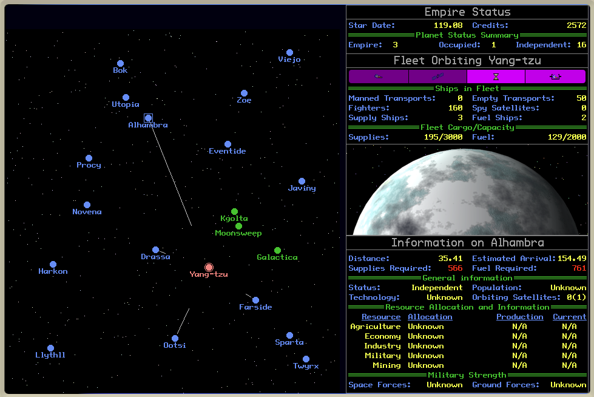

# Quick Start

See the [README](../README.md) for installation and set-up instructions.  Also see the [backstory](../reference/GE-Scroll.txt) if interested.

Once you have the game running in [Mini Micro](https://miniscript.org/MiniMicro), you should see a screen somewhat like the following.

You control one fleet, composed of the following types of ships:

- **Transports**: manned transports carry ground troops, for ground assault or holding an occupied planet.  Empty transports don't, but are ready to be manned from any planet in the Empire.

- **Space fighters**: for attacking space forces, or holding an occupied planet with space technology.

- **Spy satellites**: may be dropped off at the fleet's location, or dispatched to any remote planet, to provide intel on that planet's status.  More satellites provide more information (up to 3 per planet).  Planets in the Empire automatically get 3 satellites.

- **Supply ships**: carry supplies, so the brave men and women in your fighters and manned transports can eat on a long journey.

- **Fuel ships**: carry fuel; all ships in the fleet require fuel to travel from planet to planet.

The basic game loop is as follows:

1. When the fleet is at a planet in the Empire (shown in green on the map), build and man ships, and stock up on fuel and supplies.  Do this using the buttons in the "Information" section of the display (lower right).

2. Warp to an independent planet (blue).  Use the Attack button to attack, and if successful, use the "Occupation Forces" button next to it to add to the occupying forces.  (Alt-click or option-click the button to add space forces.)  You'll generally want to leave about 50 of each type of occupying force.

3. While a planet is occupied, it will whittle away at your occupation forces; if they are reduced to 0, the planet becomes independent again.  But if it stays occupied for 50 years or so, it will join the Empire.

Repeat this process, always going back to Empire (green) planets to rebuild, restock, and grow your fleet.  Dispatch spy satellites to give you advance info on nearby planets.

You have 1200 years to reunite the entire galaxy.
